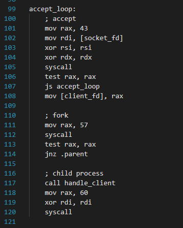
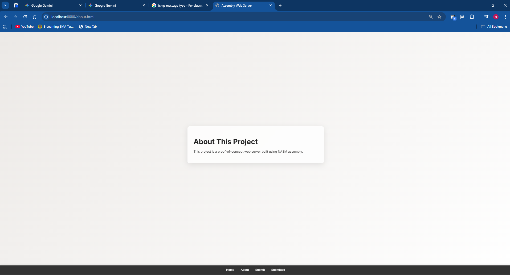
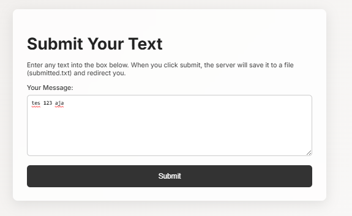
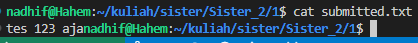
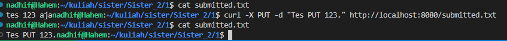
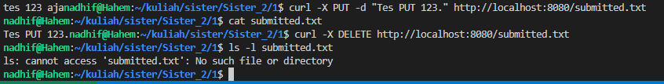
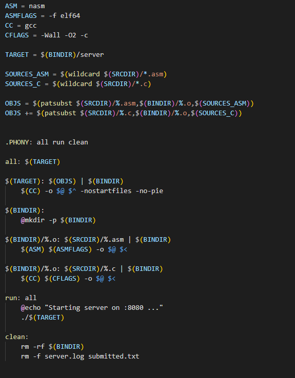
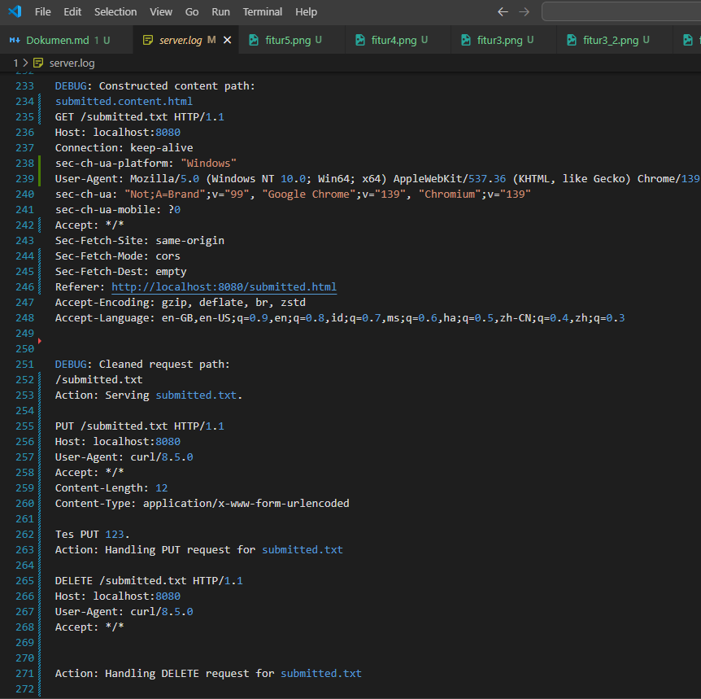
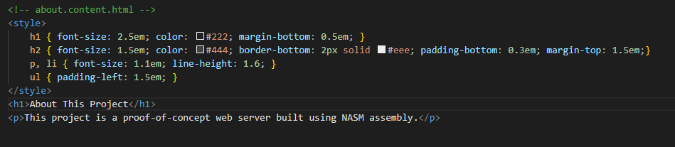

# **Dokumentasi Web Server Assembly (x86-64 Linux)**

Dokumen ini merinci fitur-fitur yang diimplementasikan dalam proyek web server yang dibangun sepenuhnya menggunakan bahasa assembly (NASM) untuk sistem operasi Linux x86-64.

## **Cara Menjalankan Server**

Sebelum menggunakan fitur-fitur di bawah, pastikan server sudah dikompilasi dan dijalankan.

1.  **Kompilasi Proyek:**
    Buka terminal di direktori utama proyek dan jalankan `make`.
    ```bash
    make
    ```

2.  **Jalankan Server:**
    Setelah kompilasi berhasil, jalankan binary server. Server akan berjalan di `http://localhost:8080`.
    ```bash
    ./bin/server
    ```

---

## **Fitur-Fitur yang Diimplementasikan**

### **1. Server HTTP Konkuren**

* **Deskripsi:**
    Inti dari server ini adalah kemampuannya untuk menerima koneksi TCP dan menangani beberapa klien secara bersamaan menggunakan `fork()`.

* **Cara Kerja:**
    Server menggunakan serangkaian syscall Linux: `socket` untuk membuat endpoint komunikasi, `bind` untuk mengaitkannya dengan port 8080, `listen` untuk menunggu koneksi masuk, dan `accept` untuk menerima koneksi dari klien. Setelah sebuah koneksi diterima, server segera membuat proses anak (child process) menggunakan syscall `fork()`. Proses anak bertugas menangani seluruh permintaan dari klien tersebut, sementara proses induk (parent process) langsung kembali ke `accept` untuk melayani klien baru.

* **Cara Menggunakan:**
    Fitur ini aktif secara otomatis saat Anda menjalankan `./bin/server`. Anda dapat mensimulasikan beberapa klien dengan membuka beberapa tab browser atau terminal yang mengakses server secara bersamaan.

* **Screenshot:**
    
    

---

### **2. Penayangan File Statis dan Sistem Templating**

* **Deskripsi:**
    Server dapat menyajikan file statis seperti CSS dan JavaScript, serta merender halaman HTML secara dinamis dengan memasukkan konten ke dalam sebuah template utama.

* **Cara Kerja:**
    Saat menerima request GET, `send_page.asm` akan memeriksa URI yang diminta.
    1.  **File Statis:** Jika URI berakhiran `.css` atau `.js`, server akan mengirimkan header HTTP yang sesuai (`Content-Type: text/css`, dll.) dan konten file tersebut secara langsung.
    2.  **Templating:** Jika URI adalah halaman HTML (misalnya `/about.html` atau `/`), server akan mencari file konten yang relevan (misalnya `about.content.html`). Kemudian, ia membaca file `template.html` (layout utama) dan file konten ke dalam buffer memori. Server mencari placeholder `{{content}}` di dalam template dan menggantinya dengan isi dari file konten. Hasil gabungan ini kemudian dikirim ke klien.

* **Cara Menggunakan:**
    Buka browser dan kunjungi `http://localhost:8080/` untuk melihat halaman utama atau `http://localhost:8080/about.html` untuk melihat halaman "About".

* **Screenshot:**

    

---

### **3. Penanganan Form (Metode POST)**

* **Deskripsi:**
    Server mampu menerima data yang dikirim melalui form HTML dengan metode POST dan menyimpannya ke dalam sebuah file di sisi server.

* **Cara Kerja:**
    Ketika request POST diterima di endpoint `/submit`, `server.asm` akan memanggil fungsi `handle_submit`. Fungsi ini akan mem-parsing *body* dari request HTTP untuk menemukan data formulir (misalnya, `text=Ini+pesan+saya`). Data ini kemudian diekstrak dan ditulis ke dalam file `submitted.txt` menggunakan syscall `sys_open`, `sys_write`, dan `sys_close`. Setelah berhasil menyimpan, server mengirimkan respons `HTTP 302 Found` untuk mengalihkan browser klien ke halaman `/submitted.html`.

* **Cara Menggunakan:**
    1.  Buka `http://localhost:8080/submit.html`.
    2.  Ketik pesan apa pun di dalam kotak teks.
    3.  Klik tombol "Submit".
    4.  Anda akan dialihkan ke halaman `/submitted.html` yang akan menampilkan konten yang baru saja Anda kirim.

* **Screenshot:**

    

    

---

### **4. Pembuatan/Penggantian Konten (Metode PUT)**

* **Deskripsi:**
    Fitur ini memungkinkan klien untuk membuat atau mengganti konten file `submitted.txt` sepenuhnya menggunakan metode HTTP PUT.

* **Cara Kerja:**
    Request dengan metode PUT akan ditangani oleh `handle_put.asm`. Handler ini akan mengambil seluruh *body* dari request. Kemudian, ia membuka file `submitted.txt` dengan flag `O_WRONLY | O_CREAT | O_TRUNC`, yang berarti: tulis-saja, buat jika belum ada, dan kosongkan isinya jika sudah ada. Seluruh *body* request kemudian ditulis ke file tersebut. Server akan merespons dengan `HTTP 201 Created` untuk menandakan kesuksesan.

* **Cara Menggunakan:**
    Gunakan `curl` di terminal untuk mengirim request PUT.
    ```bash
    curl -X PUT -d "Konten baru yang dikirim via metode PUT." http://localhost:8080/submitted.txt
    ```

* **Screenshot:**

    

---

### **5. Penghapusan Konten (Metode DELETE)**

* **Deskripsi:**
    Fitur ini memungkinkan klien untuk menghapus file `submitted.txt` dari server menggunakan metode HTTP DELETE.

* **Cara Kerja:**
    Request dengan metode DELETE ditangani oleh `handle_delete.asm`. Logikanya sangat sederhana: ia hanya memanggil satu syscall Linux, yaitu `sys_unlink`, dengan path ke `submitted.txt`. Jika file berhasil dihapus, syscall akan mengembalikan 0, dan server akan mengirim respons `HTTP 204 No Content`. Jika gagal (misalnya file tidak ada), server akan mengirim `HTTP 404 Not Found`.

* **Cara Menggunakan:**
    Gunakan `curl` di terminal untuk mengirim request DELETE.
    ```bash
    curl -X DELETE http://localhost:8080/submitted.txt
    ```

* **Screenshot:**

    

### **6. Integrasi dengan binary C**

* **Deskripsi:**
    Proyek ini menunjukkan bagaimana kode assembly (NASM) dapat diintegrasikan secara mulus dengan kode C. Fungsionalitas yang lebih mudah ditangani di C, seperti *logging* file, diimplementasikan dalam C dan dipanggil dari assembly.

* **Cara Kerja:**
    `Makefile` dikonfigurasi untuk mengkompilasi file `.c` menggunakan `gcc` dan file `.asm` menggunakan `nasm`, menghasilkan file objek (`.o`) untuk masing-masing. Kemudian, `gcc` digunakan sebagai *linker* untuk menggabungkan semua file objek ini menjadi satu *binary executable* tunggal bernama `server`. Dari dalam kode assembly, fungsi C (`log_msg`) dideklarasikan sebagai `extern` dan dipanggil menggunakan konvensi pemanggilan standar x86-64.

* **Cara Menggunakan:**
    Fitur ini digunakan secara otomatis selama proses kompilasi. Cukup jalankan perintah `make` di terminal. Proses ini akan mengkompilasi kedua jenis file sumber dan menautkannya bersama

* **Screenshot:**
    Ambil screenshot dari file `Makefile` yang menyorot baris di mana `gcc` digunakan untuk mengkompilasi file C dan baris di mana `gcc` digunakan untuk menautkan semua file `.o` menjadi satu.

    

---

[KREATIFITAS]
### **7. Logging Manual**

* **Deskripsi:**
    Server secara aktif mencatat peristiwa penting ke dalam file `server.log`. Ini termasuk setiap permintaan mentah yang masuk, jenis permintaan (GET/POST), dan jalur file yang sedang diakses, yang sangat berguna untuk *debugging* dan melacak aktivitas server.

* **Cara Kerja:**
    Fungsi `log_msg` dalam file `logger.c` bertanggung jawab untuk menulis ke file. Fungsi ini menggunakan *syscall* `open` dengan *flag* `O_WRONLY | O_CREAT | O_APPEND` untuk memastikan file `server.log` dibuat jika belum ada dan setiap log baru ditambahkan ke akhir file tanpa menimpa yang lama. Fungsi ini kemudian menggunakan *syscall* `write` untuk menulis pesan log. Fungsi C ini dipanggil dari berbagai bagian kode assembly untuk mencatat aktivitas.

* **Cara Menggunakan:**
    1.  Jalankan server.
    2.  Lakukan beberapa permintaan ke server (misalnya, buka beberapa halaman di browser).
    3.  Buka terminal terpisah dan jalankan perintah `tail -f server.log` atau `cat server.log` untuk melihat log yang dihasilkan secara *real-time*.

* **Screenshot:**
    Ambil screenshot terminal yang menampilkan isi dari file `server.log` setelah beberapa permintaan dibuat. Ini akan menunjukkan format log dan informasi yang dicatat.

    

---

[KREATIFITAS]
### **8. Template Rendering**

* **Deskripsi:**
    Server menggunakan sistem *rendering template* sisi server yang sederhana untuk menyajikan halaman web. Ini memungkinkan *layout* web utama (header, footer, navigasi) untuk didefinisikan sekali dalam file `template.html`, dan konten spesifik halaman disuntikkan ke dalamnya sesuai permintaan.

* **Cara Kerja:**
    Ketika sebuah permintaan untuk halaman HTML diterima, fungsi `render_html_template` di `send_page.asm` akan:
    1.  Membaca file `www/template.html` ke dalam *buffer* memori.
    2.  Membaca file konten yang sesuai (misalnya, `about.content.html`) ke *buffer* kedua.
    3.  Memindai *buffer template* untuk mencari *string placeholder* `{{content}}`.
    4.  Setelah ditemukan, *placeholder* tersebut diganti dengan seluruh isi dari *buffer* konten menggunakan fungsi `find_and_replace`.
    5.  Hasil HTML yang telah digabungkan kemudian dikirimkan ke browser klien sebagai respons.

* **Cara Menggunakan:**
    Buka browser Anda dan navigasikan ke halaman mana pun yang menggunakan *template*, seperti `http://localhost:8080/about.html` atau `http://localhost:8080/submit.html`.

* **Screenshot:**
    